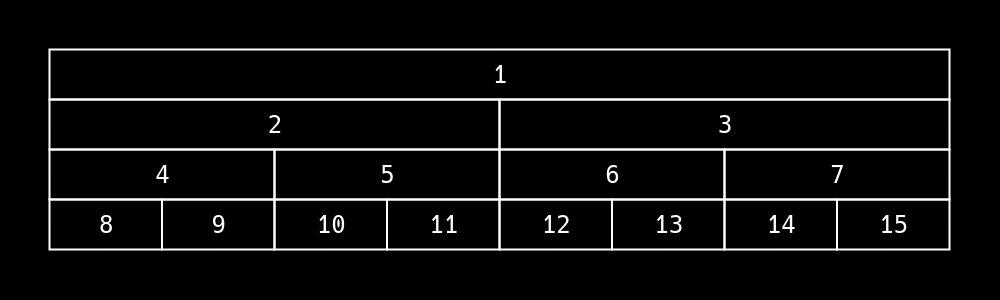
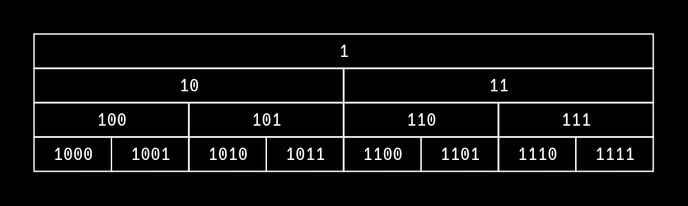
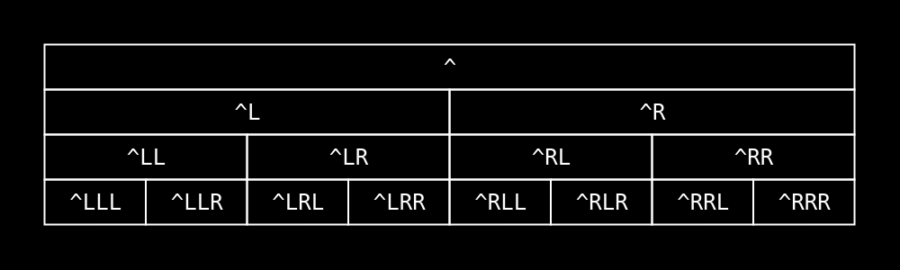

+++
title = 'Why I use `<<1|1` instead of `*2+1` when coding a segment tree'
date = 2024-02-18T16:48:13+03:00
author = "Olcay Oransoy"
type = "post"

description = "This is a draft."
draft = true
[_build]
  list = 'never'
+++

<!--more-->



Consider the two following snippets of code:

```cpp
void update(int i, int x) {
  seg[i] = x;
  while (i != 1) {
    i /= 2;
    seg[i] = max(seg[i*2], seg[i*2+1]);
  }
}

void update(int i, int x) {
  seg[i] = x;
  while (i != 1) {
    i >>= 1;
    seg[i] = max(seg[i<<1], seg[i<<1|1]);
  }
}
```

These are two implementations of the point-update function of an iterative segment tree. Despite being practically equivalent, I think the second implementation is far better than the first.

Looking at `i*2+1` makes me think of the linear equation $2i+1$. This implies a ring, so the abstraction `int` mentally resolves to $\mathbb{Z}$. Associating the vertices with $\mathbb{Z}$ implies this labeling for a segment tree:



On the other hand, looking at `i<<1|1` makes me think of appending a `1` to `i`. This implies a sequence, so the abstraction `int` resolves to a sequence of bits, leading to this labeling:



Well, what is a segment tree in reality? Well, it's a binary tree. Its vertices have left and right children. It seems intuitively obvious to me that this is the labeling that corresponds the most to the intrinsic structure of a segment tree:



I think `^RRLRLL` looks less like $116$ than like `1110100`. "$165427$ is the right child of $82713$" seems like a ridiculous proposition in comparison to "`101000011000110011` is the right child of  `10100001100011001`".

---

Here is the p5.js script I wrote to generate the segtree images: https://editor.p5js.org/ooransoy/sketches/cvltFYiN1
